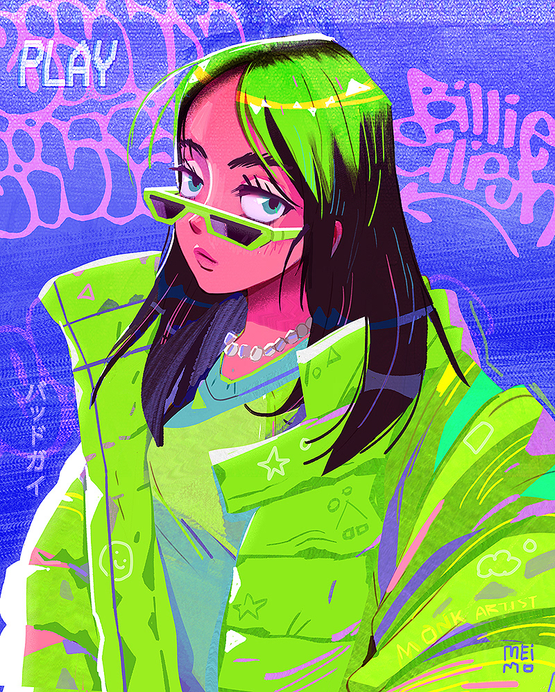

<!-- Hero logo -->

  

<h2 align="center">Billie Eilish 4K Desktop Wallpapers</h2>

  <em>Neon &amp; dark 4K wallpapers curated by N1H4D</em>

<!-- 4K wallpapers hero image -->

  <strong>4K WALLPAPERS</strong>

  

<!-- Neon title / description SVG -->

  

<!-- Download button -->

  

<!-- Features section -->

  

<!-- Extra preview wallpaper -->

  

<!-- Built with Node.js badge -->

  

